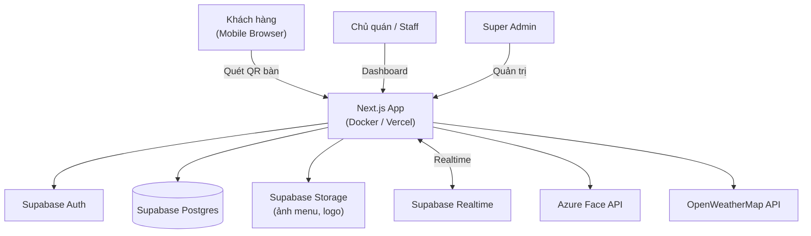
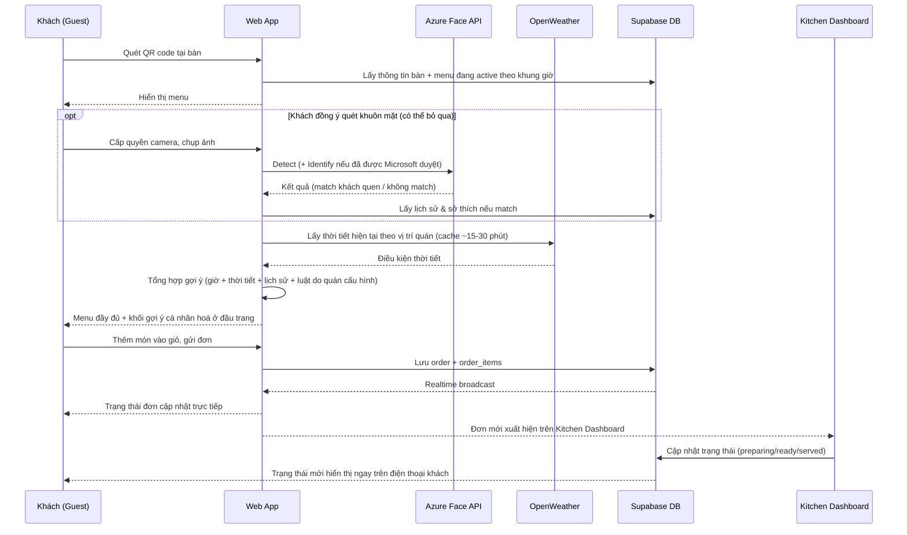
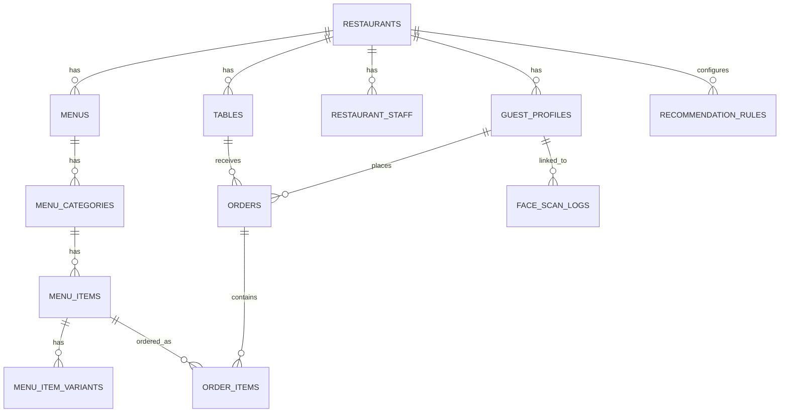

# SmartMenu — Kế hoạch Dự án Toàn diện
### Nền tảng SaaS quản lý Nhà hàng, Menu số & Gợi ý món ăn thông minh

> **Trạng thái:** Bản kế hoạch v1.0 — dùng để giao cho AI coding agent (Claude Code hoặc tương đương) thực thi xây dựng toàn bộ hệ thống.
> **Quy ước ngôn ngữ:** Tài liệu = Tiếng Việt. Code, biến, tên bảng DB, comment = Tiếng Anh (chuẩn ngành).
> **Cập nhật lần cuối:** 09/07/2026

---

## ⚠️ ĐỌC TRƯỚC TIÊN — Lưu ý bảo mật

Trong lúc lên kế hoạch, một số secret **thật** đã được cung cấp (Supabase Service Role Key, mật khẩu Postgres, Azure Face key, OpenWeather key). File này **không chứa giá trị thật của bất kỳ secret nào** — chỉ liệt kê *tên* biến môi trường cần thiết (xem mục 12). Trước khi bắt đầu code thật:

1. **Không** dán giá trị secret thật vào file `.md` này, vào code, vào commit message, hay vào bất kỳ nơi có thể lên Git repository công khai.
2. Mọi secret thật chỉ được đặt trong `.env.local` (đã bị gitignore) hoặc biến môi trường của nền tảng deploy (Vercel/Docker host).
3. Vì các key ở trên đã từng được dán vào một cuộc hội thoại/chat, nên **đổi lại mật khẩu Database và tạo lại (regenerate) Supabase Service Role Key** trong Supabase Dashboard (Project Settings → Database, và → API) trước khi go-live — thao tác này mất khoảng 1 phút, không ảnh hưởng gì tới dữ liệu hiện có. `SUPABASE_SERVICE_ROLE_KEY` bỏ qua toàn bộ Row Level Security, tương đương quyền admin tuyệt đối trên database — tuyệt đối không để lộ ra client/browser.

---

## Mục lục

0. [Hướng dẫn dành cho AI thực thi kế hoạch này](#0)
1. [Tổng quan & Mục tiêu](#1)
2. [Vai trò người dùng](#2)
3. [Phạm vi tính năng chi tiết](#3)
4. [Luồng người dùng chính](#4)
5. [Kiến trúc hệ thống & Công nghệ](#5)
6. [Mô hình dữ liệu](#6)
7. [Tích hợp bên thứ ba](#7)
8. [Bảo mật & Tuân thủ pháp lý](#8)
9. [Cấu trúc thư mục đề xuất](#9)
10. [Lộ trình triển khai theo Phase (checklist)](#10)
11. [Định nghĩa "Hoàn thành"](#11)
12. [Hướng dẫn cài đặt môi trường & Docker](#12)
13. [Giới hạn quan trọng cần lưu ý](#13)
14. [Giả định đã đưa ra & câu hỏi mở](#14)
15. [Bước tiếp theo](#15)

---

<a id="0"></a>
## 0. Hướng dẫn dành cho AI thực thi kế hoạch này

Nếu bạn là AI (Claude Code hoặc agent khác) được giao file này để xây dựng SmartMenu, hãy tuân thủ:

1. **Đọc toàn bộ file này trước khi viết dòng code đầu tiên.** Làm theo thứ tự Phase ở mục 10, không nhảy cóc sang tính năng ở Phase sau khi Phase trước chưa xong.
2. **Duy trì file `PROGRESS.md`** ở thư mục gốc repo (tự tạo nếu chưa có). Sau mỗi tính năng/task hoàn thành, ghi lại: đã làm gì, quyết định kỹ thuật nào đã chọn (và vì sao, nếu khác với kế hoạch), vấn đề còn tồn đọng.
3. **Tick `[x]` vào checklist ở mục 10 ngay khi hoàn thành**, trước khi chuyển sang mục tiếp theo. Đây là cơ chế để "tiếp tục đúng chỗ" khi bị giới hạn (rate limit/context limit) phải dừng giữa chừng — phiên làm việc sau chỉ cần đọc lại file này + `PROGRESS.md` là biết chính xác đang ở đâu, không cần đoán hay làm lại từ đầu.
4. Một mục chỉ được đánh dấu "hoàn thành" khi thoả **Định nghĩa Hoàn thành** ở mục 11 (build/type-check sạch, test liên quan pass, tự kiểm tra thủ công theo kịch bản ở mục 4).
5. **Không tự ý bỏ hoặc đơn giản hoá âm thầm** một tính năng đã liệt kê. Nếu phát hiện điều gì đó không khả thi như kế hoạch (ví dụ giới hạn của Azure Face API ở mục 7.2), phải ghi rõ trong `PROGRESS.md`, đề xuất phương án thay thế đã có sẵn trong file này (các mục có đánh dấu "phương án thay thế"), rồi tiếp tục — không dừng lại chờ hỏi trừ khi thực sự bế tắc.
6. **Không hardcode secret** vào code/commit dưới bất kỳ hình thức nào (kể cả trong comment, log, hay file test). Luôn dùng biến môi trường theo `.env.example` ở mục 12.
7. Ưu tiên các tăng trưởng nhỏ, có thể build/test được, hơn là viết một khối lượng lớn code rồi mới test. Chạy `npm run build` + `npm run lint` + `npm run typecheck` sau mỗi thay đổi đáng kể.
8. Các tích hợp bên ngoài (Supabase, Azure Face, OpenWeather) cần môi trường có **kết nối mạng thật** để test end-to-end — nếu môi trường hiện tại không có mạng, hãy scaffold code đầy đủ + viết rõ trong `PROGRESS.md` phần nào cần người dùng tự chạy `docker compose up` / deploy để kiểm tra thực tế.

---

<a id="1"></a>
## 1. Tổng quan & Mục tiêu

**SmartMenu** là nền tảng SaaS đa người thuê (multi-tenant) cho phép nhiều nhà hàng/quán ăn cùng vận hành trên một hệ thống chung: tạo menu số tuỳ biến đẹp mắt, nhận order từ khách (không cần đăng nhập), quản lý doanh thu, và gợi ý món ăn cá nhân hoá dựa trên khuôn mặt (khách quen), thời gian trong ngày và thời tiết.

Vì hệ thống là **bộ mặt trực tiếp trước khách hàng** và ảnh hưởng doanh thu thực tế, hai tiêu chí xuyên suốt toàn bộ kế hoạch là:
- **Tốc độ & độ mượt cho khách gọi món** (menu tải nhanh, đặt món tối đa vài chạm, không bắt buộc đăng nhập/tải app).
- **Tính thẩm mỹ có thể tuỳ biến** cho từng quán (font, màu, ảnh động) mà chủ quán không cần biết thiết kế vẫn ra được menu đẹp.

### Mục tiêu thành công (gợi ý KPI, có thể chỉnh)
| Chỉ số | Mục tiêu |
|---|---|
| Thời gian tải trang menu công khai | < 2 giây (4G) |
| Số bước từ quét QR đến đặt món thành công | ≤ 4 chạm |
| Tỷ lệ đơn hàng lỗi/thất bại | < 1% |
| Uptime hệ thống | ≥ 99.5% |
| Thời gian chủ quán tạo xong 1 menu mới (dùng template) | < 15 phút |

### Tên dự án
Đề xuất giữ tên **"SmartMenu"** (trùng với tên resource Azure Face các bạn đã tạo — `smartmenu.cognitiveservices.azure.com`). Có thể đổi tuỳ ý, chỉ cần tìm-thay thế trong code.

---

<a id="2"></a>
## 2. Vai trò người dùng

| Vai trò | Mô tả | Quyền chính |
|---|---|---|
| **Super Admin** | Đội vận hành nền tảng SmartMenu | Duyệt/khoá nhà hàng, quản lý toàn bộ user, xem doanh thu & hoạt động toàn hệ thống, cấu hình gói dịch vụ (nếu thu phí), audit log |
| **Restaurant Owner** | Chủ quán, có thể sở hữu nhiều nhà hàng | Toàn quyền trên (các) nhà hàng của mình: menu, đơn hàng, doanh thu, nhân viên, cấu hình gợi ý món, cấu hình nhận diện khuôn mặt |
| **Staff** (Manager/Kitchen/Waiter) | Nhân viên được chủ quán mời vào | Quyền giới hạn theo vai trò con: xem & cập nhật trạng thái đơn (Kitchen), quản lý bàn (Waiter), gần như Owner nhưng không đổi cấu hình thanh toán/nhân sự (Manager) |
| **Guest** | Khách đến quán, quét QR tại bàn | Xem menu, đặt món, theo dõi trạng thái đơn — **không bắt buộc tạo tài khoản** |

RLS (Row Level Security) của Supabase sẽ được thiết lập để một `owner`/`staff` chỉ đọc/ghi được dữ liệu thuộc `restaurant_id` mà họ có quyền — xem mục 8.

---

<a id="3"></a>
## 3. Phạm vi tính năng chi tiết

Ký hiệu: 🟢 MVP (Phase 1) · 🟡 Phase 2 · 🔵 Phase 3 (mở rộng)

### 3.1 Super Admin Portal
- 🟢 Danh sách & duyệt/khoá nhà hàng đăng ký mới
- 🟢 Quản lý user toàn hệ thống (tìm kiếm, đổi vai trò, khoá tài khoản)
- 🟢 Dashboard tổng quan: tổng số nhà hàng, tổng đơn hàng, tổng doanh thu toàn hệ thống theo thời gian
- 🟡 Audit log (ai làm gì, khi nào)
- 🔵 Quản lý gói dịch vụ/subscription cho nhà hàng (nếu SmartMenu thu phí — xem mục 14)

### 3.2 Restaurant Owner Portal
- 🟢 Thiết lập hồ sơ quán: tên, logo, ảnh bìa, địa chỉ, giờ mở cửa, mô tả
- 🟢 CRUD Menu / Category / Món ăn (giá, mô tả, ảnh, tình trạng còn/hết món)
- 🟢 Quản lý bàn & tạo QR code cho từng bàn
- 🟢 Bảng điều khiển đơn hàng thời gian thực (Kitchen Dashboard kiểu Kanban: Chờ xác nhận → Đang làm → Sẵn sàng → Đã phục vụ)
- 🟢 Dashboard doanh thu: theo ngày/tuần/tháng, món bán chạy, giờ cao điểm
- 🟢 Mời & phân quyền nhân viên
- 🟡 **Menu Builder nâng cao**: kéo-thả sắp xếp vị trí category/món ăn, xem trước trực tiếp (live preview)
- 🟡 Thư viện **Theme Template** (bộ màu, font, phong cách) + tuỳ chỉnh riêng
- 🟡 Cấu hình **luật gợi ý món ăn** (theo giờ, theo thời tiết, combo/set riêng của quán)
- 🟡 Bật/tắt & cấu hình tính năng nhận diện khuôn mặt (xem 3.6 và mục 7.2 về giới hạn thật của Azure)
- 🔵 Đa chi nhánh (nếu Owner có nhiều quán) — báo cáo gộp

### 3.3 Guest Ordering (khách đặt món — không cần tài khoản)
- 🟢 Quét QR tại bàn → mở menu số của đúng quán + đúng bàn đó
- 🟢 Xem menu theo category, hình ảnh, mô tả, nhãn (bán chạy/mới/cay/chay)
- 🟢 Thêm giỏ hàng, chọn biến thể (size/topping), ghi chú, gửi đơn
- 🟢 Theo dõi trạng thái đơn theo thời gian thực (không cần refresh trang)
- 🟡 Màn hình xin đồng ý quét khuôn mặt (rõ ràng, có thể bỏ qua — xem 3.6)
- 🟡 Gợi ý món cá nhân hoá hiển thị ngay đầu menu (không thay thế menu đầy đủ)
- 🔵 Đặt món trước (pre-order) khi chưa tới quán
- 🔵 Thanh toán online (xem mục 14 — cần xác nhận thêm)

### 3.4 Menu Builder — "đẹp và bắt mắt"
Đây là tính năng cạnh tranh cốt lõi vì khách hàng nhìn trực tiếp vào đây:
- 🟢 CRUD cơ bản: tên, mô tả, giá, ảnh (upload lên Supabase Storage), sắp xếp thứ tự bằng số thứ tự
- 🟡 Kéo-thả (drag & drop) sắp xếp món/category, xem trước theo thời gian thực
- 🟡 **Theme Template**: 4–6 mẫu giao diện dựng sẵn (vd: Tối giản hiện đại / Sang trọng nền tối / Trẻ trung nhiều màu / Fine-dining) — mỗi mẫu định nghĩa sẵn cặp font (qua `next/font/google`), bảng màu, kiểu thẻ món (bo góc, đổ bóng, tỉ lệ ảnh)
- 🟡 Tuỳ biến riêng: đổi màu chủ đạo, chọn font từ danh sách đã duyệt (tránh chọn font xấu/khó đọc), tải logo
- 🟡 Hiệu ứng chuyển động nhẹ (Framer Motion): fade-in khi cuộn, phóng to nhẹ khi hover/chạm — **không lạm dụng để tránh chậm máy khách**
- 🟡 **"AI hỗ trợ"** (dùng LLM, có thể là Claude API hoặc bất kỳ LLM API nào bạn có sẵn — xem mục 14, hiện chưa có key được cung cấp cho phần này):
  - Viết/gợi ý mô tả món ăn hấp dẫn từ tên món + nguyên liệu chủ quán nhập
  - Gợi ý bộ theme (màu/phong cách) phù hợp dựa trên loại hình quán (vd "quán lẩu" → tông ấm; "trà sữa" → pastel)
  - **Lưu ý thực tế:** LLM phù hợp để hỗ trợ *nội dung* (mô tả, gợi ý theme) hơn là tự vẽ layout điểm-ảnh chính xác — phần sắp xếp vị trí trực quan vẫn nên dựa trên template + kéo-thả có kiểm soát, để đảm bảo luôn đẹp và nhất quán thay vì phụ thuộc hoàn toàn vào AI "đoán" bố cục.
- 🔵 Ảnh động/illustration phức tạp hơn qua Lottie (tuỳ chọn)

### 3.5 Đơn hàng & Vận hành
- 🟢 Trạng thái đơn: `pending → confirmed → preparing → ready → served → completed` (+ `cancelled`)
- 🟢 Cập nhật realtime hai chiều: Kitchen Dashboard thấy đơn mới ngay lập tức; khách thấy trạng thái đơn cập nhật ngay trên điện thoại
- 🟡 Giới hạn tốc độ gửi đơn theo bàn/thiết bị để chống spam (vì guest không cần đăng nhập)
- 🔵 In hoá đơn / kết nối máy in bếp (nếu cần, thường qua thiết bị phần cứng riêng — ngoài phạm vi phần mềm này)

### 3.6 Nhận diện khuôn mặt & Gợi ý món ăn thông minh
Xem chi tiết ràng buộc thật của Azure Face API ở **mục 7.2** — phần này mô tả tính năng theo hướng khả thi ngay, có ghi rõ phần cần xin phép Microsoft.
- 🟢 **Engine gợi ý theo ngữ cảnh** (không cần khuôn mặt, chạy được ngay): kết hợp giờ trong ngày (sáng/trưa/chiều/tối/khuya do quán tự cấu hình khung giờ), thời tiết hiện tại (trời mưa/lạnh → gợi ý món nóng/canh; trời nóng → đồ uống lạnh), món bán chạy, và **combo/set do chủ quán tự cấu hình sẵn**
- 🟡 Màn hình xin đồng ý quét khuôn mặt: rõ ràng mục đích, có nút "Bỏ qua" luôn hoạt động đầy đủ (đặt món không bao giờ bị chặn nếu khách từ chối)
- 🟡 Face **Detect** (xác nhận có khuôn mặt, chất lượng ảnh) — dùng được ngay, không cần xin phép Microsoft
- 🟡 *(Cần Microsoft duyệt — xem 7.2)* Face **Identify**: nhận ra khách quen đã từng "cho phép ghi nhớ" trước đó → lấy lịch sử đơn/sở thích → gợi ý theo lịch sử thay vì đoán mù
- ❌ **Không xây dựng** tính năng suy đoán tuổi/giới tính/cảm xúc từ khuôn mặt để gợi ý món — Microsoft đã ngừng hẳn (gender, emotion) hoặc giới hạn nghiêm ngặt (age) khả năng này cho mục đích thương mại thông thường (xem 7.2). Việc dùng ngữ cảnh (giờ/thời tiết/lịch sử/luật do quán cấu hình) tạo ra giá trị "thông minh" tương đương mà không phụ thuộc vào một tính năng có thể không bao giờ được cấp phép.

### 3.7 Doanh thu & Báo cáo
- 🟢 Theo từng nhà hàng: tổng doanh thu, số đơn, giá trị đơn trung bình, top món bán chạy, biểu đồ theo ngày/tuần/tháng
- 🟢 Toàn hệ thống (Super Admin): tổng hợp trên toàn bộ nhà hàng
- 🟡 Xuất báo cáo (CSV/PDF)
- 🔵 Dự báo đơn giản (trung bình trượt) cho nhập hàng/chuẩn bị nguyên liệu

### 3.8 Thông báo
- 🟢 Trong ứng dụng qua Realtime (đơn mới, đơn sẵn sàng)
- 🔵 Push notification (PWA service worker / app di động)
- 🔵 Tóm tắt doanh thu cuối ngày qua email hoặc Zalo OA (phổ biến với chủ quán VN)

### 3.9 Đa nền tảng (Mobile/Tablet)
- 🟢 Responsive đầy đủ cho mobile & tablet (menu khách hàng chủ yếu được xem trên điện thoại khi quét QR)
- 🟢 Chế độ tablet cho quầy/bàn (self-order kiosk hoặc thiết bị nhân viên order)
- 🟡 PWA: cài được vào màn hình chính, hoạt động cơ bản khi mất mạng tạm thời
- 🔵 App di động riêng (React Native/Expo) cho Owner/Staff — quản lý đơn khi không ở máy tính

---

<a id="4"></a>
## 4. Luồng người dùng chính

### 4.1 Kiến trúc tổng thể



### 4.2 Luồng khách đặt món (kèm gợi ý thông minh)



### 4.3 Luồng chủ quán dựng menu
1. Đăng nhập → chọn nhà hàng → **Menu Builder**
2. Chọn 1 Theme Template làm điểm bắt đầu (hoặc tự tạo từ đầu)
3. Thêm Category → thêm Món ăn (tên, giá, ảnh, mô tả — có nút "AI viết giúp mô tả")
4. Kéo-thả sắp xếp thứ tự category/món, xem trước trực tiếp bên phải màn hình
5. Cấu hình khung giờ áp dụng menu (vd Menu sáng: 6h–10h30)
6. (Tuỳ chọn) Cấu hình luật gợi ý: combo theo giờ, theo thời tiết
7. Lưu & Publish → khách quét QR thấy ngay bản mới

---

<a id="5"></a>
## 5. Kiến trúc hệ thống & Công nghệ

### 5.1 Bảng công nghệ

| Lớp | Công nghệ đề xuất | Lý do |
|---|---|---|
| Frontend Framework | **Next.js 16** (App Router) + TypeScript, React 19 | Đã kiểm tra: bản ổn định mới nhất tính đến 07/2026, Turbopack mặc định, SSR tốt cho SEO trang menu công khai, API routes tích hợp sẵn. Yêu cầu Node.js ≥ 20 |
| UI/Styling | TailwindCSS + shadcn/ui | Tuỳ biến theme theo từng quán dễ dàng, tốc độ phát triển nhanh |
| Animation | Framer Motion (+ Lottie tuỳ chọn ở Phase 3) | Hiệu ứng menu mượt mà, có kiểm soát hiệu năng |
| Kéo-thả Menu Builder | dnd-kit | Chuẩn phổ biến, nhẹ, hỗ trợ tốt sắp xếp danh sách lồng nhau (category → món) |
| State phía client | TanStack Query (đồng bộ server state) + Zustand (state UI cục bộ) | Cache & đồng bộ dữ liệu thông minh, giảm gọi API thừa |
| Database chính | **Supabase (PostgreSQL)** | Đã có sẵn; RLS mạnh cho multi-tenant; JSONB đủ linh hoạt cho theme/layout config nên không cần thêm NoSQL cho MVP |
| Auth | Supabase Auth | Tích hợp sẵn với DB, map thẳng sang RLS qua `auth.uid()` |
| Lưu trữ ảnh | Supabase Storage | Đã có sẵn, kèm CDN, tích hợp thẳng với Auth/RLS cho việc phân quyền ảnh theo quán |
| Realtime | Supabase Realtime | Cập nhật trạng thái đơn hàng tức thời hai chiều, không cần polling |
| Nhận diện khuôn mặt | Azure Face API | Đã có key sẵn — **xem giới hạn quan trọng ở mục 7.2** |
| Thời tiết | OpenWeatherMap — endpoint `Current Weather Data` (2.5) | Đã có key sẵn; endpoint này miễn phí, không cần thẻ thanh toán, đủ dùng cho "thời tiết hiện tại" (xem 7.3) |
| Containerization | Docker + docker-compose | Theo yêu cầu, triển khai được ở nhiều nơi (VPS, self-host) |
| Mobile | Responsive + PWA (`next-pwa`) ngay từ Phase 1; React Native/Expo cho Owner/Staff ở Phase 3 | Ưu tiên ra mắt nhanh trên trình duyệt mobile (nơi khách thực sự thao tác), mở rộng app riêng sau khi core ổn định |
| Testing | Vitest (unit) + Playwright (E2E) | Phủ logic quan trọng (tính tiền, recommendation engine) và luồng chính |
| Deploy gợi ý | Vercel (cho Next.js) hoặc VPS + Docker | Vercel đơn giản nhất cho Next.js; Docker theo đúng yêu cầu để tự host nếu cần |

### 5.2 Về việc dùng MongoDB
Bạn có sẵn MongoDB, nhưng khuyến nghị **không dùng ở MVP**: dữ liệu của hệ thống này (đơn hàng, doanh thu, user, menu) chủ yếu là quan hệ & cần tính toàn vẹn (ACID) — Postgres qua Supabase xử lý tốt, kể cả phần cấu hình linh hoạt (theme, layout) nhờ cột JSONB. Dùng thêm một database thứ hai làm tăng độ phức tạp vận hành (2 kết nối, 2 nguồn sự thật, đồng bộ dữ liệu) mà chưa có nhu cầu rõ ràng. Trường hợp hợp lý để dùng Mongo sau này: log sự kiện khối lượng lớn, ít quan trọng về toàn vẹn dữ liệu (vd `analytics_events` ghi lại lượt xem món/thời gian dừng ở từng món) — có thể thêm ở Phase 3 nếu cần, không ảnh hưởng kiến trúc core.

### 5.3 Đa người thuê (Multi-tenancy)
Một database Postgres dùng chung, mỗi bảng thuộc phạm vi nhà hàng đều có cột `restaurant_id`, kết hợp **Row Level Security** để một `owner`/`staff` chỉ truy cập được đúng nhà hàng họ có quyền (qua bảng `restaurant_staff` map `user_id ↔ restaurant_id ↔ role`). Đây là mô hình chuẩn, tiết kiệm chi phí và được Supabase hỗ trợ tốt nhất — chi tiết ở mục 8.

---

<a id="6"></a>
## 6. Mô hình dữ liệu

### 6.1 Sơ đồ quan hệ (rút gọn)



### 6.2 Chi tiết các bảng chính

| Bảng | Mục đích | Trường quan trọng |
|---|---|---|
| `profiles` | Mở rộng `auth.users` | `role` (super_admin/owner/staff/), `full_name`, `phone` |
| `restaurants` | Thông tin nhà hàng | `owner_id`, `name`, `slug`, `logo_url`, `theme_settings` (JSONB), `timezone`, `status` |
| `restaurant_staff` | Phân quyền nhân viên theo quán | `restaurant_id`, `user_id`, `role` (manager/waiter/kitchen) |
| `tables` | Bàn ăn & QR | `restaurant_id`, `table_number`, `qr_code_token` (unique) |
| `menus` | 1 quán có thể nhiều menu (sáng/tối/cuối tuần) | `restaurant_id`, `name`, `schedule_rules` (JSONB: khung giờ áp dụng), `theme_template_id` |
| `menu_categories` | Nhóm món trong 1 menu | `menu_id`, `name`, `sort_order` |
| `menu_items` | Món ăn | `category_id`, `name`, `description`, `base_price`, `images` (array), `tags` (array), `is_available`, `sort_order` |
| `menu_item_variants` | Biến thể (size/topping) | `menu_item_id`, `name`, `price_delta` |
| `menu_templates` | Thư viện theme dựng sẵn | `name`, `font_config`, `color_palette`, `preview_image_url` |
| `orders` | Đơn hàng | `restaurant_id`, `table_id`, `guest_profile_id` (nullable), `status`, `subtotal`, `total` |
| `order_items` | Chi tiết món trong đơn | `order_id`, `menu_item_id`, `variant_id`, `quantity`, `unit_price` |
| `guest_profiles` | Khách quen đã opt-in "ghi nhớ tôi" | `restaurant_id`, `face_person_id` (nullable, Azure PersonGroup Person ID — chỉ có nếu Identify được Microsoft duyệt), `phone` (nullable), `preferences` (JSONB), `opted_in_face` |
| `recommendation_rules` | Luật gợi ý do quán tự cấu hình | `restaurant_id`, `rule_type` (time_of_day/weather/combo), `conditions` (JSONB), `suggested_item_ids` |
| `face_scan_logs` | Nhật ký quét mặt (tuân thủ pháp lý — xem mục 8) | `restaurant_id`, `matched`, `consent_given`, `created_at`, `expires_at` |
| `revenue_daily_summary` | Tổng hợp doanh thu (view hoặc bảng aggregate) | `restaurant_id`, `date`, `total_orders`, `total_revenue` |
| `notifications` | Thông báo trong app | `recipient_id`, `type`, `payload`, `read_at` |
| `audit_logs` | Nhật ký hành động (Super Admin) | `actor_user_id`, `action`, `entity`, `metadata` |

> Toàn bộ migration SQL chi tiết (kèm index, constraint, RLS policy) sẽ được viết trong `supabase/migrations/` khi thực thi Phase 0 — không liệt kê hết ở đây để giữ file kế hoạch gọn.

---

<a id="7"></a>
## 7. Tích hợp bên thứ ba

### 7.1 Supabase — lưu ý quan trọng về IPv4/IPv6 khi chạy Docker

Đã xác minh (07/2026): **Direct connection** của Supabase (`db.<project-ref>.supabase.co:5432`) hiện chỉ chạy qua **IPv6**, trừ khi mua thêm gói **IPv4 add-on** (trả phí). Nhiều môi trường Docker/VPS mặc định chỉ có IPv4 → đây chính xác là lý do bạn lo ngại "Docker sẽ không connect được Supabase".

**Giải pháp (bạn đã có sẵn đúng connection string cần dùng):**
- Chuỗi bạn cung cấp — `aws-1-ap-south-1.pooler.supabase.com:5432` — là **Supavisor Shared Pooler, chế độ Session mode**. Pooler này **hỗ trợ IPv4 trên MỌI gói kể cả Free**, hoạt động gần như connection trực tiếp (hỗ trợ prepared statement), rất hợp để chạy migration hoặc kết nối Postgres bền vững từ container Docker.
- Nếu cần connection ngắn hạn/serverless (vd Edge Function, API route chạy trên nền tảng serverless), dùng thêm **Transaction mode** ở cổng **6543** cùng host pooler.
- **Quan trọng:** phần lớn traffic của app (đọc/ghi qua `supabase-js`) đi qua **HTTPS REST/Realtime**, hoàn toàn không liên quan tới vấn đề IPv6 ở trên — vấn đề IPv4/IPv6 chỉ ảnh hưởng khi có kết nối Postgres thô (raw `postgres://`) từ ORM/migration tool. Vì vậy: dùng `supabase-js` (với type generate từ `supabase gen types typescript`) làm lớp truy cập dữ liệu chính cho runtime; chỉ dùng chuỗi pooler ở trên cho migration/script admin.

### 7.2 Azure Face API — ⚠️ giới hạn thật cần biết trước khi thiết kế

Đã xác minh trực tiếp từ tài liệu Microsoft (07/2026), tính năng nhận diện khuôn mặt bị giới hạn theo chính sách **Responsible AI / Limited Access** của Microsoft — ảnh hưởng trực tiếp tới thiết kế ở mục 3.6:

| Khả năng | Trạng thái | Ghi chú |
|---|---|---|
| **Detect** (khung mặt, chất lượng ảnh, mờ/sáng/kính/góc mặt...) | ✅ Dùng ngay được, không cần xin phép | Đủ để làm bước "xác nhận có người đang nhìn camera" |
| Suy đoán **giới tính, cảm xúc** | ❌ Đã **ngừng hẳn**, không cấp cho bất kỳ ai kể cả xin phép | Không nên thiết kế tính năng phụ thuộc vào 2 thuộc tính này |
| Suy đoán **tuổi, nụ cười, kiểu tóc, râu, trang điểm** | 🟡 "Limited" — phải gửi email cho đội Azure Face giải trình use case cụ thể, không đảm bảo được duyệt | Không nên là phần bắt buộc của tính năng cốt lõi |
| **Identify/Verify** (nhận diện ĐÂY LÀ AI — vd khách quen) + PersonGroup | 🟡 Yêu cầu đăng ký & được Microsoft duyệt qua "Face Recognition intake form" trước khi dùng ở production | Cần chủ động nộp đơn sớm vì thời gian duyệt không cố định |

**Ảnh hưởng tới thiết kế:** vì vậy bản kế hoạch này (mục 3.6) **không** đặt "suy đoán đặc điểm khuôn mặt để đoán món phù hợp" làm tính năng lõi — thay vào đó dùng ngữ cảnh (giờ/thời tiết/lịch sử/luật quán cấu hình) làm engine gợi ý chính, hoạt động được 100% ngay từ đầu và không phụ thuộc phê duyệt bên ngoài. Tính năng "nhận ra khách quen" (Identify) được thiết kế như một lớp tăng cường tuỳ chọn, có thể bật lên sau khi đơn xin của bạn được Microsoft duyệt — code nên được viết theo kiểu feature flag (`FACE_IDENTIFY_ENABLED`) để bật/tắt dễ dàng mà không cần sửa kiến trúc.

### 7.3 OpenWeatherMap

Đã xác minh (07/2026): endpoint **`/data/2.5/weather`** (Current Weather Data) là **miễn phí hoàn toàn, không cần thẻ thanh toán**, giới hạn 60 calls/phút và 1 triệu calls/tháng — quá đủ cho nhu cầu "lấy thời tiết hiện tại theo thành phố của quán". Endpoint mới hơn "One Call 3.0/4.0" (dùng cho dự báo dài hạn/lịch sử) yêu cầu thêm thẻ thanh toán ngay cả ở gói miễn phí — **không cần dùng** cho tính năng này.

Khuyến nghị kỹ thuật: cache kết quả thời tiết theo `restaurant_id`/thành phố trong khoảng 15–30 phút (dữ liệu gốc của OpenWeather cũng chỉ cập nhật mỗi ~10 phút), tránh gọi API mỗi lần khách load menu.

### 7.4 Cổng thanh toán (chưa triển khai ở MVP — xem mục 14)
Nếu cần thanh toán online, các lựa chọn phổ biến tại VN: VNPay, MoMo, ZaloPay (nội địa); Stripe (thẻ quốc tế). Xem mục 14 để xác nhận có cần ở giai đoạn nào.

---

<a id="8"></a>
## 8. Bảo mật & Tuân thủ pháp lý

### 8.1 Row Level Security (RLS) — bắt buộc bật trên MỌI bảng có `restaurant_id`
Nguyên tắc chung (ví dụ minh hoạ, không phải SQL cuối cùng):
```sql
-- Owner/staff chỉ thấy dữ liệu của nhà hàng họ thuộc về
create policy "restaurant_isolation" on menu_items
  for all using (
    exists (
      select 1 from restaurant_staff
      where restaurant_staff.restaurant_id = menu_items.restaurant_id
      and restaurant_staff.user_id = auth.uid()
    )
  );

-- Guest (không đăng nhập) chỉ được ĐỌC món đang available của menu đang active
create policy "public_read_available_items" on menu_items
  for select using (is_available = true);
```

### 8.2 Secrets
- Toàn bộ secret qua biến môi trường, không hardcode (xem mục 12).
- `SUPABASE_SERVICE_ROLE_KEY` chỉ dùng ở server (API routes/route handlers), tuyệt đối không import vào component client.
- Xoay vòng (rotate) key định kỳ và ngay khi nghi ngờ lộ lọt.

### 8.3 Dữ liệu sinh trắc học (khuôn mặt) — quy định pháp luật Việt Nam
Đã xác minh (07/2026) — đây là **thông tin tham khảo, không phải tư vấn pháp lý**, khuyến nghị làm việc với luật sư/chuyên gia tuân thủ trước khi ra mắt tính năng quét mặt cho công chúng:

- Theo **Nghị định 13/2023/NĐ-CP**, dữ liệu về "đặc điểm sinh học riêng của cá nhân" (bao gồm dữ liệu khuôn mặt dùng cho nhận diện) được xếp vào **dữ liệu cá nhân nhạy cảm**, đòi hỏi sự đồng ý rõ ràng, có thể chứng minh được, và chủ thể phải được thông báo rằng đây là dữ liệu nhạy cảm trước khi xử lý.
- **Luật Bảo vệ dữ liệu cá nhân 2025** (hiệu lực từ 01/01/2026) quy định thêm: sự đồng ý cho dữ liệu hình ảnh/sinh trắc học phải **tách biệt riêng**, không được gộp chung vào điều khoản sử dụng chung — tức là màn hình xin quét mặt phải có checkbox/consent riêng, không thể "ẩn" trong Điều khoản dịch vụ.
- Hệ thống camera AI nhận diện khuôn mặt được khuyến nghị chuẩn bị **Hồ sơ đánh giá tác động xử lý dữ liệu cá nhân (DPIA)**.
- **Thiết kế bắt buộc trong sản phẩm** để đáp ứng tinh thần các quy định trên (chi tiết kỹ thuật ở mục 3.6):
  - Consent phải là hành động chủ động (bấm nút đồng ý), không suy diễn từ im lặng.
  - Luôn có lựa chọn "Bỏ qua" hoạt động đầy đủ — không được ép buộc quét mặt để đặt món.
  - Cho phép khách yêu cầu xoá dữ liệu đã lưu (face template/guest profile) bất cứ lúc nào.
  - Không lưu ảnh gốc lâu dài nếu không cần thiết — chỉ lưu face template/ID cần cho việc nhận diện.
  - Ghi log bảng `face_scan_logs` phục vụ minh bạch & audit.

### 8.4 Chống lạm dụng (Guest ordering không cần đăng nhập)
- Rate limit theo `table_id`/IP cho endpoint tạo đơn.
- Cân nhắc Cloudflare Turnstile/CAPTCHA nhẹ nếu phát hiện lạm dụng thực tế (không bật mặc định để tránh làm chậm trải nghiệm khách).

---

<a id="9"></a>
## 9. Cấu trúc thư mục đề xuất

```
smartmenu/
├── app/
│   ├── (guest)/[restaurantSlug]/[tableToken]/   # Trang đặt món công khai
│   ├── (owner)/dashboard/                       # Portal chủ quán
│   ├── (admin)/admin/                           # Portal Super Admin
│   ├── api/                                     # Route handlers (order, face, weather...)
│   └── layout.tsx
├── components/
│   ├── menu-builder/
│   ├── kitchen-dashboard/
│   └── ui/                                      # shadcn/ui components
├── lib/
│   ├── supabase/          # client, server, types (generated)
│   ├── azure-face/
│   ├── weather/
│   └── recommendation-engine/
├── types/
├── public/
├── supabase/
│   ├── migrations/
│   └── seed.sql
├── Dockerfile
├── docker-compose.yml
├── .env.example
├── SmartMenu_Project_Plan.md      # chính là file này
├── PROGRESS.md                    # AI tự tạo & cập nhật khi thực thi
└── README.md
```

> Khi bước sang Phase 3 (thêm app di động React Native), tái cấu trúc thành monorepo (`apps/web`, `apps/mobile`, `packages/shared`) — không cần làm trước vì tăng độ phức tạp không cần thiết cho MVP.

---

<a id="10"></a>
## 10. Lộ trình triển khai theo Phase (checklist)

> AI thực thi: tick `[x]` ngay khi hoàn thành từng mục, theo đúng thứ tự Phase.

### Phase 0 — Khởi tạo & Hạ tầng
- [ ] Khởi tạo repo Next.js 16 (App Router, TypeScript, TailwindCSS, ESLint, Prettier)
- [ ] Kết nối Supabase project, chạy migration tạo toàn bộ bảng theo mục 6
- [ ] Cấu hình Supabase Auth + bảng `profiles` (trigger tự tạo profile khi user đăng ký)
- [ ] Tạo Storage buckets: `menu-images`, `restaurant-branding`, `avatars` + policy truy cập
- [ ] Viết RLS policy cho toàn bộ bảng (mục 8.1)
- [ ] Viết `Dockerfile` + `docker-compose.yml` (mục 12)
- [ ] Tạo `.env.example` đầy đủ + README hướng dẫn lấy từng key
- [ ] Thiết lập `supabase gen types typescript` để có type an toàn cho toàn bộ code

### Phase 1 — MVP lõi
- [ ] Auth & phân quyền theo vai trò (Super Admin / Owner / Staff)
- [ ] CRUD nhà hàng (Admin duyệt, Owner chỉnh sửa hồ sơ)
- [ ] CRUD Menu / Category / Món ăn (form cơ bản, chưa cần kéo-thả/AI)
- [ ] Trang menu công khai cho Guest — xem menu, thêm giỏ hàng, đặt món không cần đăng nhập
- [ ] Sinh QR code theo bàn → mở đúng phiên đặt món
- [ ] Luồng đơn hàng đầy đủ + cập nhật realtime (Kitchen Dashboard ⇄ khách)
- [ ] Dashboard doanh thu cơ bản cho Owner
- [ ] Trang Super Admin cơ bản (danh sách nhà hàng/user, doanh thu toàn hệ thống)
- [ ] Responsive đầy đủ mobile/tablet cho toàn bộ luồng trên

### Phase 2 — Menu Builder nâng cao & Gợi ý thông minh
- [ ] Kéo-thả sắp xếp category/món (dnd-kit) kèm xem trước trực tiếp
- [ ] Thư viện Theme Template (4–6 mẫu) + khả năng tuỳ biến màu/font riêng
- [ ] Hiệu ứng chuyển động (Framer Motion) cho menu khách xem
- [ ] Tích hợp LLM hỗ trợ viết mô tả món/gợi ý theme *(cần xác nhận API key — xem mục 14)*
- [ ] Engine gợi ý theo ngữ cảnh: giờ + thời tiết (OpenWeather) + món bán chạy + combo do quán cấu hình
- [ ] Giao diện Owner cấu hình luật gợi ý (`recommendation_rules`)
- [ ] Màn hình xin đồng ý quét khuôn mặt (consent riêng biệt theo mục 8.3) + Face Detect
- [ ] Nộp đơn xin Microsoft duyệt Face Identify (việc ngoài code — ghi nhận trạng thái trong `PROGRESS.md`)
- [ ] Tích hợp Face Identify sau khi duyệt (feature-flagged, không chặn release nếu chưa được duyệt)

### Phase 3 — Mở rộng
- [ ] PWA (cài đặt được, cache cơ bản)
- [ ] App di động (React Native/Expo) cho Owner/Staff
- [ ] Cổng thanh toán online *(nếu xác nhận cần — mục 14)*
- [ ] Push notification cho đơn mới/đơn sẵn sàng
- [ ] Đa chi nhánh cho Owner nhiều quán
- [ ] Audit log & rate limiting nâng cao
- [ ] Đa ngôn ngữ (i18n) nếu cần phục vụ khách quốc tế
- [ ] Tối ưu hiệu năng, load test

---

<a id="11"></a>
## 11. Định nghĩa "Hoàn thành"

Một mục trong checklist trên chỉ được tick `[x]` khi đáp ứng ĐỦ các điều kiện sau:

1. `next build` chạy thành công, không lỗi TypeScript.
2. `npm run lint` không có lỗi (warning cần được ghi chú lý do nếu giữ lại).
3. Unit test cho logic quan trọng (tính tổng đơn, recommendation engine, RLS-sensitive query) — pass.
4. Tự kiểm tra thủ công theo đúng kịch bản mô tả ở mục 4 (luồng khách đặt món / luồng chủ quán dựng menu) — chạy đúng như mô tả, không lỗi console.
5. Kiểm tra RLS: dùng 2 tài khoản Owner khác nhau, xác nhận Owner A **không** đọc/ghi được dữ liệu của Owner B.
6. Không có secret nào bị hardcode hoặc in ra log/console.
7. Đã cập nhật checklist mục 10 + `PROGRESS.md`.

---

<a id="12"></a>
## 12. Hướng dẫn cài đặt môi trường & Docker

### 12.1 Yêu cầu
- Node.js ≥ 20, npm hoặc pnpm
- Docker + Docker Compose
- Tài khoản Supabase (đã có), Azure Face resource (đã có), OpenWeatherMap (đã có)

### 12.2 `.env.example` (chỉ tên biến — điền giá trị thật vào `.env.local`, KHÔNG commit)
```env
# Supabase
NEXT_PUBLIC_SUPABASE_URL=
NEXT_PUBLIC_SUPABASE_ANON_KEY=
SUPABASE_SERVICE_ROLE_KEY=          # server-only, KHÔNG expose ra client
SUPABASE_DB_POOLER_URL=             # session mode (port 5432), dùng cho migration/script — xem mục 7.1

# Azure Face API
AZURE_FACE_KEY=
AZURE_FACE_ENDPOINT=
FACE_IDENTIFY_ENABLED=false         # bật = true sau khi Microsoft duyệt Identify (mục 7.2)

# OpenWeatherMap
OPENWEATHER_API_KEY=

# App
NEXT_PUBLIC_APP_URL=http://localhost:3000
NODE_ENV=development
```

### 12.3 Dockerfile (multi-stage, Next.js standalone output)
```dockerfile
# ---- deps ----
FROM node:20-alpine AS deps
WORKDIR /app
COPY package.json package-lock.json* ./
RUN npm ci

# ---- builder ----
FROM node:20-alpine AS builder
WORKDIR /app
COPY --from=deps /app/node_modules ./node_modules
COPY . .
ARG NEXT_PUBLIC_SUPABASE_URL
ARG NEXT_PUBLIC_SUPABASE_ANON_KEY
ARG NEXT_PUBLIC_APP_URL
ENV NEXT_PUBLIC_SUPABASE_URL=$NEXT_PUBLIC_SUPABASE_URL
ENV NEXT_PUBLIC_SUPABASE_ANON_KEY=$NEXT_PUBLIC_SUPABASE_ANON_KEY
ENV NEXT_PUBLIC_APP_URL=$NEXT_PUBLIC_APP_URL
RUN npm run build

# ---- runner ----
FROM node:20-alpine AS runner
WORKDIR /app
ENV NODE_ENV=production
RUN addgroup --system --gid 1001 nodejs && adduser --system --uid 1001 nextjs
COPY --from=builder /app/public ./public
COPY --from=builder --chown=nextjs:nodejs /app/.next/standalone ./
COPY --from=builder --chown=nextjs:nodejs /app/.next/static ./.next/static
USER nextjs
EXPOSE 3000
ENV PORT=3000
CMD ["node", "server.js"]
```
*(Yêu cầu `next.config.ts` có `output: 'standalone'`)*

### 12.4 docker-compose.yml
```yaml
services:
  web:
    build:
      context: .
      dockerfile: Dockerfile
      args:
        NEXT_PUBLIC_SUPABASE_URL: ${NEXT_PUBLIC_SUPABASE_URL}
        NEXT_PUBLIC_SUPABASE_ANON_KEY: ${NEXT_PUBLIC_SUPABASE_ANON_KEY}
        NEXT_PUBLIC_APP_URL: ${NEXT_PUBLIC_APP_URL}
    ports:
      - "3000:3000"
    env_file:
      - .env.local
    restart: unless-stopped
```

### 12.5 Chạy local
```bash
cp .env.example .env.local   # rồi điền giá trị thật
npm install
npm run dev                  # chạy trực tiếp, không qua Docker — nhanh nhất khi phát triển
# hoặc
docker compose up --build    # chạy qua Docker, giống môi trường production
```

### 12.6 Migration Supabase
```bash
npx supabase link --project-ref <project-ref>
npx supabase db push          # áp dụng migrations/*.sql
npx supabase gen types typescript --linked > types/database.ts
```

### 12.7 Deploy
- **Next.js app**: Vercel là lựa chọn đơn giản nhất (build tự động, không cần quản lý server) — hoặc VPS + `docker compose up -d` phía sau Nginx/Caddy làm reverse proxy + SSL.
- **Database**: đã hosted trên Supabase, không cần tự triển khai.

---

<a id="13"></a>
## 13. Giới hạn quan trọng cần lưu ý

Phần này nói thẳng để không kỳ vọng sai:

1. **Nếu file kế hoạch này được giao cho AI chạy trong môi trường sandbox không có kết nối mạng ra internet** (như môi trường tạo ra file này): AI có thể viết đầy đủ code, cấu hình Docker, migration SQL, và tự kiểm tra bằng type-check/lint/unit test — nhưng **không thể** tự gọi thật tới Supabase/Azure Face/OpenWeatherMap để test tích hợp end-to-end. Việc test thật (đăng nhập thật, đặt món thật, quét mặt thật) cần chạy ở môi trường có mạng — local máy bạn, VPS, hoặc một coding agent có quyền truy cập mạng (ví dụ Claude Code chạy trên máy/server có internet).
2. **"Không lỗi" nên hiểu là:** build sạch + type-check sạch + test tự động pass + đã tự kiểm tra thủ công theo mục 11 — không phải một sự đảm bảo tuyệt đối 0% lỗi trong mọi tình huống (không phần mềm thực tế nào đạt được điều đó ngay từ v1). Cách tiếp cận thực tế nhất: triển khai từng Phase nhỏ, test kỹ trước khi qua Phase sau, thay vì kỳ vọng một lần chạy duy nhất ra sản phẩm hoàn hảo tuyệt đối.
3. **Face Identify (nhận khách quen) phụ thuộc phê duyệt của Microsoft** (mục 7.2) — đây là quy trình bên ngoài, không nằm trong tầm kiểm soát của việc viết code. Engine gợi ý theo ngữ cảnh (giờ/thời tiết/luật quán) được thiết kế để hoạt động đầy đủ mà không cần chờ phê duyệt này.
4. Dự án có phạm vi tương đương một sản phẩm SaaS thực thụ (nhiều tháng công sức với một đội thật) — lộ trình theo Phase ở mục 10 giúp có sản phẩm dùng được sớm (cuối Phase 1) thay vì chờ mọi thứ xong mới dùng được gì.

---

<a id="14"></a>
## 14. Giả định đã đưa ra & câu hỏi mở

Các quyết định dưới đây đã được chọn theo hướng hợp lý nhất để có thể bắt đầu ngay — bạn chỉ cần nhắn lại nếu muốn đổi:

| Chủ đề | Giả định mặc định trong kế hoạch | Nếu muốn khác |
|---|---|---|
| Thanh toán | Chưa tích hợp cổng thanh toán online ở MVP — khách đặt món, thanh toán tại quầy/tiền mặt như hiện tại | Cho biết muốn dùng VNPay/Momo/ZaloPay/Stripe để thêm vào Phase 3 |
| App di động | PWA (web cài vào màn hình chính) ở Phase 1, React Native riêng cho Owner/Staff ở Phase 3 | Cho biết nếu cần app native ngay từ đầu |
| Mô hình doanh thu của bản thân SmartMenu | Chưa xây tính năng thu phí subscription giữa bạn và các chủ quán — có thể thêm sau vì schema đã hỗ trợ | Cho biết nếu đây là sản phẩm sẽ bán cho nhiều chủ quán khác trả phí sử dụng |
| **AI hỗ trợ viết mô tả/gợi ý theme (mục 3.4)** | **Chưa có API key** cho phần này trong danh sách bạn cung cấp (chỉ có Supabase/Azure Face/OpenWeather) | Cần bạn cung cấp thêm 1 API key LLM (Anthropic Claude API, OpenAI, hoặc tương đương) nếu muốn tính năng này hoạt động — nếu chưa có, Phase 2 sẽ tạm dùng mô tả nhập tay + theme chọn sẵn (không mất chức năng cốt lõi) |
| Ngôn ngữ giao diện | Tiếng Việt là ngôn ngữ chính, cấu trúc code sẵn sàng cho i18n sau | Cho biết nếu cần song ngữ Việt/Anh ngay từ Phase 1 |
| Nhận diện khuôn mặt | Dùng cho "nhận khách quen" (Identify, cần Microsoft duyệt) + Detect ngay được; **không** dùng để suy đoán tuổi/giới tính (mục 7.2, 3.6) | — (đây là giới hạn kỹ thuật thật từ Microsoft, không phải lựa chọn có thể đổi bằng cách yêu cầu) |

---

<a id="15"></a>
## 15. Bước tiếp theo

1. Đọc lại mục 14 — xác nhận hoặc chỉnh các giả định.
2. Nếu muốn tính năng AI hỗ trợ viết mô tả/theme (mục 3.4), chuẩn bị thêm 1 API key LLM.
3. Cân nhắc nộp đơn xin Microsoft duyệt Face Identify sớm (mục 7.2) vì thời gian chờ không cố định, trong khi các Phase khác vẫn triển khai song song.
4. Đổi mật khẩu Database + tạo lại Service Role Key trong Supabase Dashboard (như lưu ý đầu file) trước khi giao file này cho bất kỳ công cụ/AI nào để bắt đầu code.
5. Giao file này cho AI coding agent (khuyến nghị dùng công cụ có quyền truy cập mạng thật + chạy được nhiều phiên liên tục, ví dụ Claude Code) để bắt đầu từ Phase 0.
